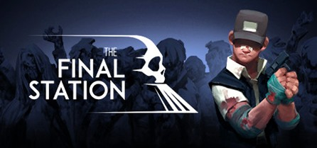

# The Final Station

  

*This game is a 2D side-scrolling shooter video game that combines exploration, survival, and narrative elements. It shows how to create tension and emotional resonance without relying on complex systems, using simple mechanics in conjunction with clever level structures and resource constraints.*

## Key Game Mechanics

The main gameplay loop can be summarised as:  
**Arrive at a location → Explore → Manage danger and resources → Complete objectives → Evacuate → Progress to the next location.**  
This loop is repeated across different “stations,” each acting as a self-contained level with its own challenges and narrative fragments.

---

## A. Level Structure
- Levels are mostly linear side-scrolling environments with small branching paths.
- Progression is controlled through locked doors, power systems, and environmental obstacles.
- Each area feels distinct while following a consistent structural pattern.
- The structure makes the game easy to extend with new levels.

---

## B. Game Objectives
- The ultimate objective is to reach the extraction point.
- Interactive objectives include:
  - Restoring power
  - Activating equipment (switches, circuit breakers, generators)
  - Rescuing and escorting survivors to different stations

---

## C. Character Abilities
- **Basics:** Movement, jumping, climbing/fall handling  
- **Combat:** Shooting/melee, emphasising ammo conservation and distance control  
- **Interaction:** Opening doors, reading notes, installing parts, using control panels  
  - These interactions make levels feel more like “doing something” rather than just running and jumping.

---

## D. Resource Management
- Ammunition and medical resources are relatively scarce.
- Supply points/safe houses provide brief respites.
- This creates a **tension → buffer → tension** rhythm similar to survival horror.
- Poor early resource decisions can have serious consequences later in the level.

---

## E. Enemy Types
- **Slow but numerous basic enemies:** force players to keep moving.
- **Pursuing enemies:** force quick decisions (run, attack, close doors).
- **Level bosses:** high attack power and health, with difficulty increasing over time.

---

# Elements Worth Borrowing

*The game design is well-suited as a reference for a small team project. Its core concept can be broken down into modular parts and implemented step by step.*

---

## 1. A Good Gameplay Loop
- “Station → Start → Station” structure.
- Each level is a small station with:
  - A clear objective
  - Evacuation
  - Plot progression
- Levels can be developed independently by different team members.
- Very suitable for course projects with short-cycle deliverables.

---

## 2. Resource and Pace Control
- Scarce resources (ammo, medical supplies, oxygen, electricity) force meaningful decisions:
  - Exploration vs. survival vs. travel
- Resource management enhances side-scrolling gameplay.
- Players are encouraged to avoid unnecessary combat and think strategically.

---

## 3. Environmental Narrative
- Story is conveyed through:
  - Environment
  - Corpses
  - Broadcasts
  - Notes
  - Lighting
  - Sound effects
- This keeps development cost manageable while creating strong atmosphere.
- Example: restoring power via a switch may reveal the next clue.
- Objectives are simple to implement but provide strong structural support.

---

## 4. “Weak Protagonist”
- Combat emphasises:
  - Positioning
  - Timing
  - Risk
- Creates a tense survival experience rather than pure hack-and-slash.
- Adding elements like:
  - Dark areas
  - Flashlight mechanics
  - Vulnerable NPCs  
  can increase tension without requiring advanced enemy AI.
